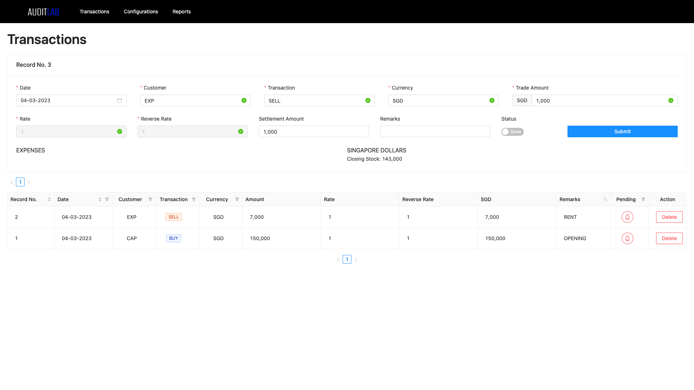
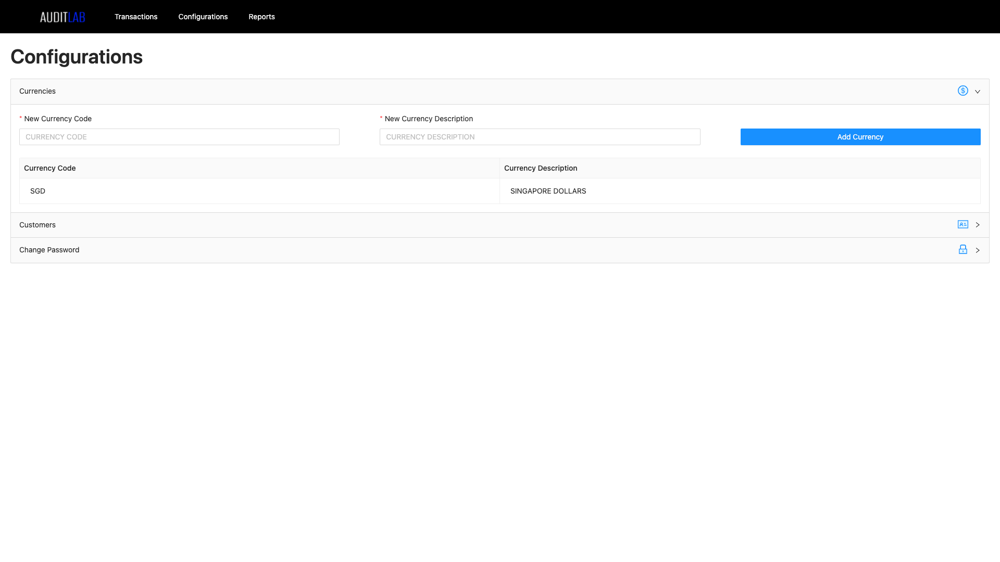
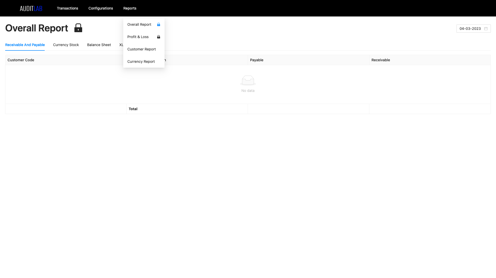

# Audit Lab

An offline Windows and Mac application that can be used for money exchange accounting.

## Install
---

### Windows:
Download:
* Check the repo's [release page](https://github.com/Rizavur/audit-lab/releases) for the latest builds
* Download the application that ends with `.exe` and the `accountingDB.sqlite`, based on the preferred base currency (SGD/USDT)
  
Install:
* Open the `.exe` application file
* Open the application and close it
* Open the Run command window by pressing `Windows + R`, enter `%AppData%` in the input field and press `OK`
* Open the `audit-lab` folder and replace accountingDB with the new one downloaded from the release page.
* The application is now ready to be used

### Mac:
Download:
* Check the repo's [release page](https://github.com/Rizavur/audit-lab/releases) for the latest builds
* Download the application that ends with `.dmg` and the `accountingDB.sqlite`, based on the preferred base currency (SGD/USDT)

Install:
* Open the `.dmg` application file and drag it into the application folder
* Open the application and close it
* Open finder and use the shortcut `Shift + Cmd + L` to enter the Library folder
* Inside Library folder, open Applicaton Support folder and then the `audit-lab` folder
* Replace accountingDB with the new one downloaded from the release page.
* The application is now ready to be used
